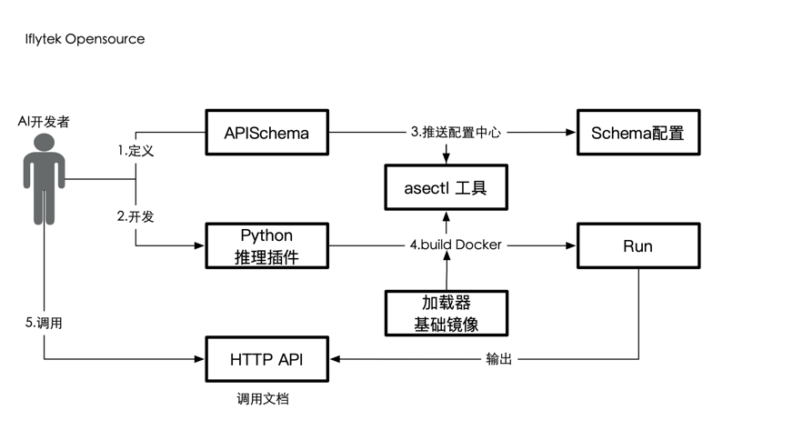

# AI推理服务框架开源版本v2设计(ASE OpenSource)


## 整体组件架构

如图: 


注:

* Kong Nginx为推介组件,使用者可以根据自身需求更换合适的接入层网关

* 配置中心、LB为可选组件

* 根据部署方式不同[见下节],docker-compose 和 kuberentes方式 实际部署架构可能存在不同的组合方式: kubernetes方式可配置使用polaris配置中心，或者使用k8s/configmap


## 用户使用流程



## Schema设计讨论

目前有两大生成schema方案,讨论下首版本支持范围

1. 用户生成式

这里细分两种方案 单页面web配置、命令行基于yaml创建式 [见命令行详细设计](#命令行工具详细设计)

2. 代码生成式

融合用户API定义和插件编写2个步骤，根据代码自动生成schema

举例: 

* 先介绍下当前python wrapper代码基础格式:

[wrapper](wrapper/wrapper.py)

增加api定义后:
```python
'''
API定义,定义用户期望的api输入输出
asectl工具将扫描python此处BaseASEApi继承类生成openapi
'''
class Api(base.BaseASEApi):
	def request(self):
	    param1 = base.Arg("param1", int, "user param1", max=10, min=11, required=True )
	    param2 = base.Arg("param2", str, "user param2", required=True )
	    param3 = base.Arg("param3", str, "user param3", required=False )

    def response(self):
        param1 = base.Arg("param1", int, "user param1", max=10, min=11, required=True )
        param2 = base.Arg("param2", str, "user param2", required=True )
        param3 = base.Arg("param3", str, "user param3", required=False )

```

[wrapper_new](wrapper/wrapper_new.py)


## 命令行工具[asectl]设计


为方便用户快速搭建部署整个AI推理服务框架，推出 ***asectl*** 工具

工具包含功能点:

* AI服务框架部署初始化: 支持 *docker-compose* , kubernetes 部署

* 支持APISchema定义

* AI引擎相关功能: 启动AI引擎，AI引擎镜像构建, AI引擎本地仿真


### 命令行工具详细设计

**asectl**

#### init

调用 docker-compose 或者 helm install 初始化推理服务框架

#### api web

工具启动一个web页面[ase的API设计页面],监听本地口


页面保存后，可以生成或者提交 schema json到 配置中心

#### api create

执行 `asectl api create -f ai_api.yml`

```yaml
apiVersion: iflytek.com/v1alpha1
kind: ApiSchema
metadata:
  group: gas # 配置中心group
  region: dx # 配置中心区域
  serviceName: image-detect # 服务名
  projectName: guiderAllService # 配置项目名称
  version: "1.0.0" # 配置版本号
  configFilname: xxxx.json # 缺省值，默认根据kind 对应配置中心特定配置文件: 如webgate的配置文件
  creationTimestamp: null
  name: my-api-schema # 生成配置文件名
spec:
  request:
    paramters:
      properties:
        # 以下为用户自定义的请求参数，可根据需求定义修改
        vcn: 
          description: "a word that xxx"
          type: string
        speed:
          description: "a speed that xxx"
          type: integer
          format: int32
          minimum: 50
          maximum: 200000
        isauto:
          description: "boolean value"
          type: boolean
        someother:
          description: "a objcet key"
          properties:
            value1:
              type: string
            value2: 
              type: string
          type: object
      required:
        - vcn
        - someother
    payload:
      properties:
        audio1:
          compress: raw
          type: audio
          encoding: speex-wb
          format: plain
        text1:
          compress: raw
          type: text
          encoding: utf-8
          format: json
        image1:
          compress: raw
          type: base64
          format: jpg
          raw: string
        vedio1:
          type: vedio
          compress: raw
          format: ""
          raw: string
      required:
        - image1
  response:
    palyload:
      properties:
        audio1:
          type: audio
          encoding: speex-wb

```

执行完次命令后在当前目录/schemas下 生成一条schema.json 并提示是否推送到配置中心


#### config upload
配置推送

#### config edit
配置编辑

#### config list
配置列表

#### config 查看
配置查看


#### loader build
辅助构建加载器镜像

#### loader test
辅助测试加载器镜像运行测试用例

#### loader run
辅助运行1个加载器服务 并注册到推理服务框架，并生成api地址，api调用文档地址

### cluster status


#### setup

配置asectl 工具， 如配置中心地址，账户密码， 区域配置


